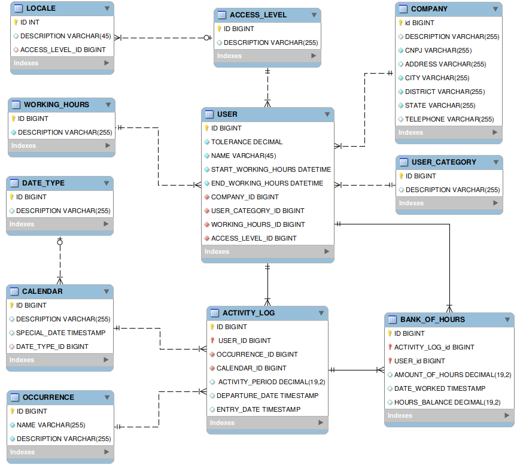
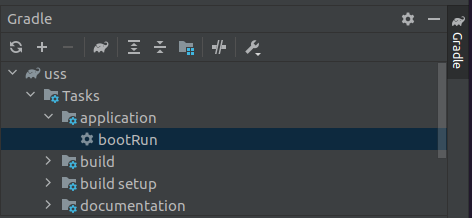

# Building an Enterprise Access Control and Employee Point System with Spring Boot


Live Code building an Enterprise Access Control and Employee Point System with Spring Boot with specialist Rodolfo Gomes by DIO (Digital Innovation One).


## Architecture developed


## Technologies
    - Java
    - Spring Boot
    - Gradle

##  How to run

  Open the project in your favorite IDE, for example
  [IntelliJ IDEA](https://www.jetbrains.com/pt-br/idea/download/#section=linux) and run the task in application > bootRun

  
  
You can access the memory bank via the url:

```
http://localhost:8081/h2/
```

You can make GET type api requests using Insomnia or Postman to create a workinghours object passing the json format body below:

```bash
http://localhost:8081/workinghours

{	
	"description":"PJ"
}
```

You can make requests for api of type PUT to change the workinghours object passing the id in the url and in the body in json format, as below

```bash
http://localhost:8081/workinghours/1

{
	"description":"CLT"
}
```
More detailed information about how the API works can be seen at.

```
http://localhost:8081/swagger-ui.html#/
```